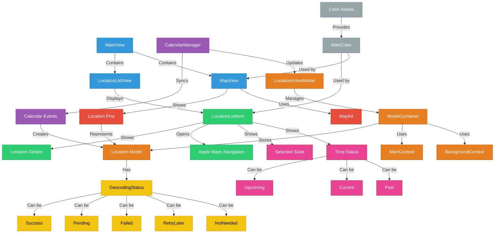

```mermaid
graph TD;
    %% Main Views - Blue
    A[MainView]:::mainView -->|Contains| B[LocationListView]:::mainView
    A -->|Contains| C[MapView]:::mainView
    
    %% Location List Components - Green
    B -->|Displays| D[LocationListItem]:::listItem
    D -->|Shows| E[Location Details]:::listItem
    D -->|Opens| F[Apple Maps Navigation]:::listItem
    
    %% Data Flow - Orange
    G[LocationsViewModel]:::dataFlow -->|Manages| H[ModelContainer]:::dataFlow
    H -->|Stores| I[Location Model]:::dataFlow
    H -->|Uses| J[MainContext]:::dataFlow
    H -->|Uses| K[BackgroundContext]:::dataFlow
    
    %% Calendar Integration - Purple
    L[CalendarManager]:::calendar -->|Syncs| M[Calendar Events]:::calendar
    M -->|Creates| I
    L -->|Updates| G
    
    %% Map Components - Red
    C -->|Shows| N[Location Pins]:::map
    C -->|Uses| O[MapKit]:::map
    N -->|Represents| I
    
    %% Location States - Yellow
    I -->|Has| P[GeocodingStatus]:::states
    P -->|Can be| Q[Success]:::states
    P -->|Can be| R[Pending]:::states
    P -->|Can be| S[Failed]:::states
    P -->|Can be| T[RetryLater]:::states
    P -->|Can be| U[NotNeeded]:::states
    
    %% UI States - Pink
    D -->|Shows| V[Selected State]:::uiStates
    D -->|Shows| W[Time Status]:::uiStates
    W -->|Can be| X[Upcoming]:::uiStates
    W -->|Can be| Y[Current]:::uiStates
    W -->|Can be| Z[Past]:::uiStates
    
    %% Styling - Gray
    AA[Color Assets]:::styling -->|Provides| AB[MainColor]:::styling
    AB -->|Used by| D
    AB -->|Used by| C

    %% Style Definitions
    classDef mainView fill:#3498db,stroke:#2980b9,color:white
    classDef listItem fill:#2ecc71,stroke:#27ae60,color:white
    classDef dataFlow fill:#e67e22,stroke:#d35400,color:white
    classDef calendar fill:#9b59b6,stroke:#8e44ad,color:white
    classDef map fill:#e74c3c,stroke:#c0392b,color:white
    classDef states fill:#f1c40f,stroke:#f39c12,color:black
    classDef uiStates fill:#e84393,stroke:#c0392b,color:white
    classDef styling fill:#95a5a6,stroke:#7f8c8d,color:white
```
