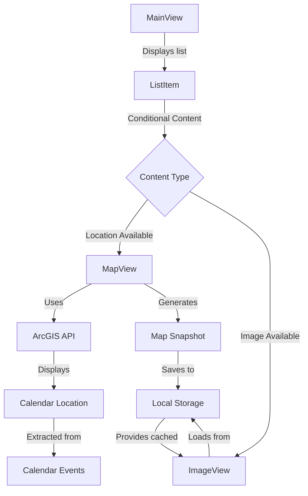

```mermaid
graph TD;
    A[MainView] -->|Displays list| B[ListItem];
    B -->|Conditional Content| C{Content Type};
    C -->|Location Available| D[MapView];
    C -->|Image Available| E[ImageView];
    D -->|Uses| F[ArcGIS API];
    D -->|Generates| G[Map Snapshot];
    G -->|Saves to| H[Local Storage];
    E -->|Loads from| H;
    F -->|Displays| I[Calendar Location];
    I -->|Extracted from| J[Calendar Events];
    H -->|Provides cached| E;
```
